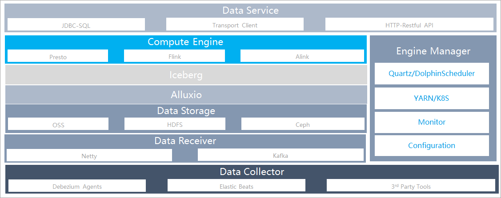

# Zeus

## An opensource analytical Engine

Zeus is an open source, analytical engine for big data hold in data lake; it was designed to provide OLAP (Online Analytical Processing) capability in the big data era.  You can use zeus to store, query,analysis, and manage data. 
Features include:

* Data Lake Management:
** Fast lake data read and write ability. 
** Automatically data converting and modeling based on OEI(Object-Event-Item Data Model).
** Manage lake data using apache iceberg.

* Resource Management:
** Pluggable resource management via k8s or YARN.

* Job/Task Management:
** Efficient Flink Job submit through JOBGraph.
** Elastic job scheduler using quartz. 

* Data Analysis:
** Fast data OLAP analysis support, including:
 User Behavior Analytics
 User Portrait
 Data Forecast  

* Data Mining:
** Powerful algorithm expansion capability, through plug-ins model.
** Flexible model and custom function expansion capabilities.

h2. Technology stack

